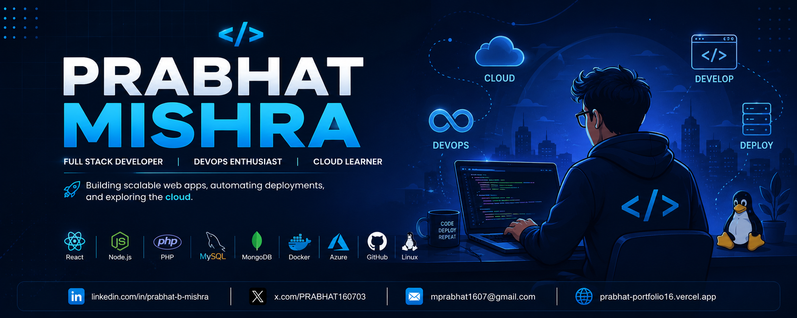

<!-- ========================= Banner ========================= -->

  

<h3 align="center">
  
</h3>

---

# 👋 Hi, I'm Prabhat Mishra

I'm a **Full Stack Developer** passionate about building scalable web applications and solving real-world problems through technology.

I enjoy working across the entire software development lifecycle—from designing responsive user interfaces to developing secure backend APIs and deploying applications using modern cloud and DevOps tools.

My core expertise includes **React, PHP, Node.js, MySQL, MongoDB, Docker, AWS, Azure, and Linux**. I'm continuously learning new technologies and enjoy building projects that create real-world impact.

📍 **Pune, Maharashtra, India**

---

  
  
  

# 🛠️ Tech Stack

  

---

# 📊 GitHub Stats

  

---

# 🌐 Let's Connect

---

# 💡 Developer Philosophy

> **"Talk is cheap. Show me the code."**
>
> — Linus Torvalds

---

  Thanks for stopping by! Feel free to connect or collaborate. 🚀

  

